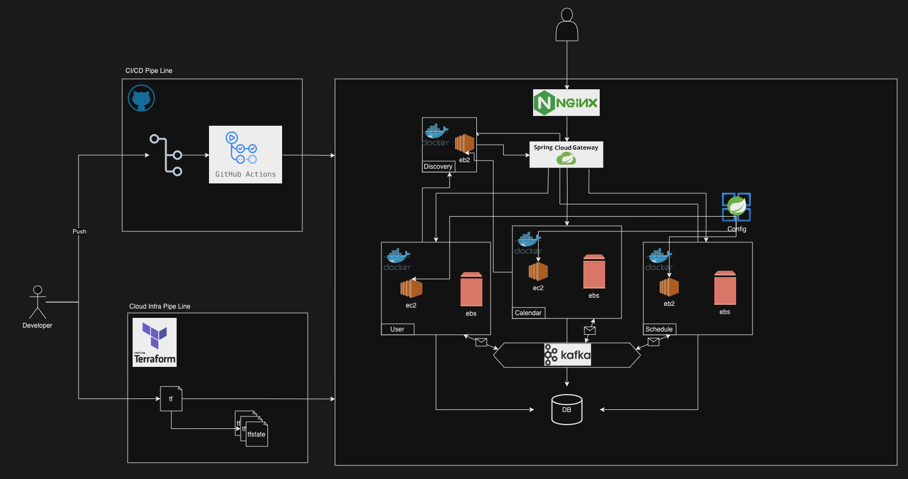
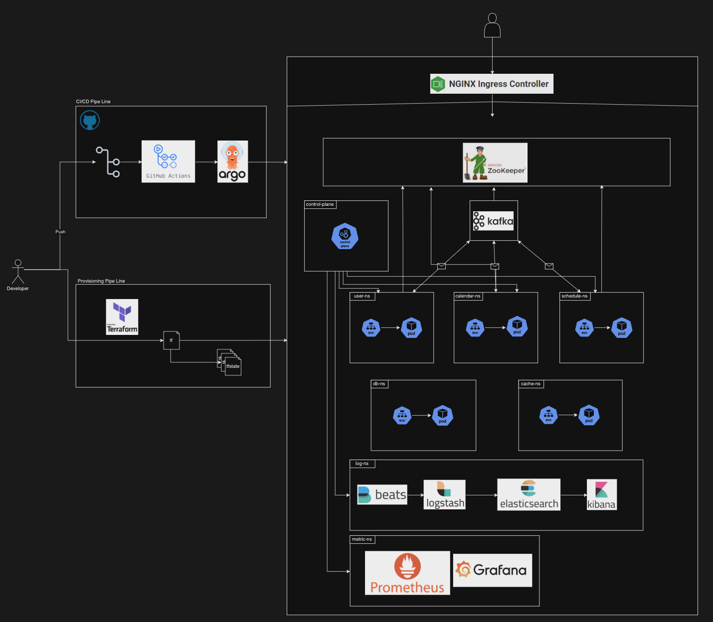

# 공유 캘린더 서비스
- 이용자들이 함께 관리할 수 있는 캘린더 서비스
# 기능
## 프론트엔드
- React.js, Next.js, Styled-Component, Tailwind, Zustand
- (ReactQuery, ReactDND)
## 백엔드
## 도메인별 기능
### User 유저
- 소셜 로그인(네이버, 카카오, 구글)/회원가입
- 권한 : 캘린더 관리자/캘린더 부관리자/일반
### Calender 달력
- 캘린더 제목(+태그) 검색/조회
- 캘린더 공개 설정
- 캘린더 생성/삭제
- 공휴일
- 캘린더 태그/라벨
- 캘린더 구독(즐겨찾기)
- 캘린더 알림 설정
### Schedule 일정
- 일정 추가/삭제/수정
- 기간 설정
- 일정 태그/라벨
- 메모
- 일정 1시간(default 1시간. 유저 별 설정 가능) 전 알림
# 아키텍처
## 1차

- 스프링 클라우드를 이용해 MSA 환경 구성
- 각 서비스 노드간 이벤트 브로커로 kafka 이용
- IaC 도구(terraform)를 이용해 클라우드 환경을 형상관리
- Git Action, Pm2를 활용해 CI/CD 구축 및 무중단 배포 환경 구성
## 목표

- 스프링 클라우드 환경을 K3S 환경으로 마이그레이션
- ELK를 활용해 Logging ns 구성
- Prometheus, Grafana를 활용해 모니터링 ns 구성
- ArgoCD를 추가해, k3s CI 구성
## 이벤트 기반 아키텍처
- 이벤트 브로커 Kafka를 이용해 이벤트 기반 아키텍처 구성
- 마이크로 서비스간 낮아짐
- 이후, '알림 서비스', '푸시 서비스' 등 새로운 서비스를 추가할 경우, 서비스 노드를 추가하기 수월
## 헥사고날 아키텍처
- 포트/어댑터 기반 헥사고날 아키텍처 구성
- 서비스 내 각 컴포넌트 간 의존도 낮아짐
## 쿠버네티스 환경
- k3s를 이용해, 쿠버네티스 환경 구성
- 유연한 무중단 및 스케일 아웃 가능
- 각 마이크로 서비스를 좀 더 분리해 서비스를 더 소형화 할 수 있음 (컨슘 노드)
    - 서비스를 더욱 세분화해 나누면, 정확히 스케일 업이 필요한 서비스의 팥만 늘려 비용 효윺 기대..
# 참고 서비스
- 타임트리
- 구글 캘린더