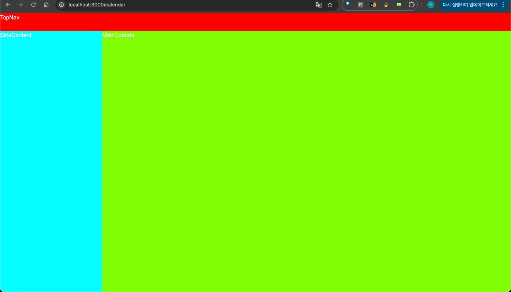

# 프론트엔드
- `.env.development`, `.env.production` 파일 추가
  - `.env.development` : dev 환경 변수
  - `.env.production` : prod 환경 변수
- `prettierrc`, `react-query` 추가 및 설정
- `react-calendar` 추가
- 아래와 같이 디렉토리 결정
```
app
├── _api
├── _component
│   ├── CalendarComponent.tsx
│   ├── MiniCalendar.tsx
│   └── layout
│       └── calendar
│           ├── CalendarLayoutContainer.tsx
│           ├── MainContent.tsx
│           ├── SideContent.tsx
│           └── TopNav.tsx
├── _hook
├── _utils
│   └── ReactQueryProvider.tsx
├── calendar
│   └── page.tsx
├── favicon.ico
├── fonts
│   ├── GeistMonoVF.woff
│   └── GeistVF.woff
├── globals.css
├── layout.tsx
├── login
│   ├── App.css
│   └── page.tsx
├── page.tsx
└── sign
    └── page.tsx
```
```
├── app               -- 페이지 및 글로벌 파일 디렉토리
│   ├── favicon.ico   -- 패비콘  
│   ├── fonts         -- 폰트
│   ├── globals.css   -- 글로벌 css
│   ├── layout.tsx    -- 글로벌 layout
│   └── page.tsx      -- Main 페이지
└── component         -- 컴포넌트 디렉토리
```

- 아래와 같이 `탑 메뉴`, `사이드 컨텐츠 공간`, `메인 컨텐츠 공간`을 `Grid Layout` 으로 잡음
